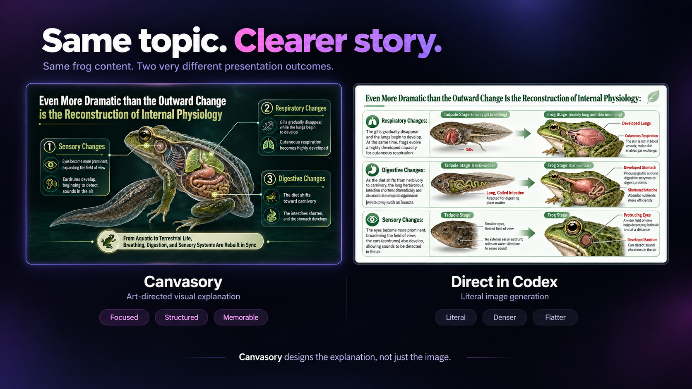

# Canvasory · Image PPTGen

**Bold visuals. A story that stays on point.**

Canvasory is a presentation-first Codex Skill that turns text or Markdown into visual slide decks. Review the page outline and choose a creative direction, then let an AI art director plan each slide’s message, text, imagery, and reading flow.

You receive a static preview, high-resolution PNGs in presentation order, and a ZIP of the deck.

*[A user-provided comparison](docs/demo/COMPARISON.md) of two frog-life presentation examples. This illustrates one example, not a controlled benchmark or a guarantee of results.*

Supported platforms are macOS ARM64 and Linux x86_64. Windows is not currently supported.

## Start in one sentence

Send this exact sentence to Codex:

> Install this Skill: https://image-pptgen.pages.dev/install.sh

Do not add a target directory, Python path, environment variable, or extra setup step. The installer and Skill manage their own location and configuration.

## Why not just ask Codex directly?

Canvasory is a packaged workflow, not a new model. It adds repeatable checkpoints around Codex: faithful pagination, whole-deck art direction, explicit approvals, generation, Preview, and export. These stages help keep the source, narrative, and visuals aligned before image generation begins.

The output is image-based. That supports strong visual consistency, but it also means revisions differ from editing ordinary text boxes in presentation software: changing slide content or composition generally requires image editing or regeneration.

## How it works

### 1. Submit the source

Give Codex plain text or Markdown. Canvasory does not accept PDF, image, screenshot, or OCR input.

### 2. Review and confirm pagination

Canvasory proposes a faithful page split before spending image-generation capacity. Review the page count, titles, and material boundaries; ask for revisions if needed. Then explicitly confirm the pagination. This confirmation does not start generation.

### 3. Choose and confirm a creative direction

Choose **Auto** or describe one creative direction for the whole deck. In Auto, the Image Director plans each slide's message, imagery, text, layout, and reading flow while keeping the deck coherent. A written direction can be refined conversationally.

Canvasory does not support separate style requests for individual slides. Whichever route you choose, including Auto, you must explicitly confirm the final whole-deck direction.

### 4. Generate, preview, and download

Only the final, unqualified confirmation starts generation. The result includes a static Preview with page navigation, zoom, and fullscreen viewing; high-resolution PNG files in presentation order; and a ZIP containing the complete deck. The Preview does not depend on a long-running local service.

## Limits and usage

Generation depends on model access and applicable usage limits; it is not unlimited free or fully offline generation. Review wording, factual accuracy, and visual details before presenting.

Presentation language follows your material and request. The samples in `eval-materials/` are evaluation inputs, not a restriction on topics.

## FAQ

**Can I change the page count without resubmitting my source?**
Yes. Revise the proposed split, then confirm the final pagination.

**Does choosing Auto begin generation?**
No. Auto still requires a separate, explicit confirmation of the final direction.

**Can I give every slide a different visual style?**
No. Canvasory uses one whole-deck creative direction so the presentation reads as a unified story.

**Can I edit every element after generation?**
The primary outputs are rendered images rather than native slide objects. Use image editing or regeneration when revisions are needed.

## Historical Image PPTGen 3.0 demo

These images come from one five-slide frog-life presentation generated with the historical Image PPTGen 3.0 workflow. They are retained as a traceable example of earlier output and are not a current 5.0 gallery. The gallery shows three selected pages; known limitations are recorded in the provenance document.

| Cover | Middle | Final |
| --- | --- | --- |
|  |  |  |

See [demo provenance](docs/demo/PROVENANCE.md) for source identity and file hashes.

## Source map

| Path | Responsibility |
| --- | --- |
| `skills/generate-image-presentation/` | Codex Skill and guided presentation workflow |
| `packages/pptgen_toolkit/` | CLI client and static Preview packaging |
| `backend/` | Pagination, generation, state, audit, and artifacts |
| `frontend/` | Preview and local review interface source |
| `packaging/image/` | macOS ARM64 and Linux x86_64 adapters |
| `eval-materials/` | English acceptance samples, not a usage limit |

The Codex Skill is the user entry point. The repository source is available at [Sander-Chen/canvasory](https://github.com/Sander-Chen/canvasory).

The current public product is Image PPTGen 5.0. Historical routes are retained as technical history, not selectable product modes.
