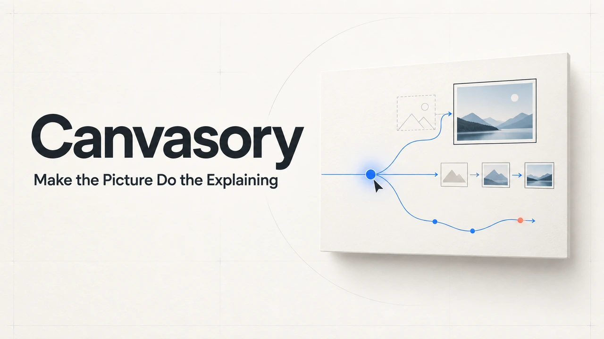
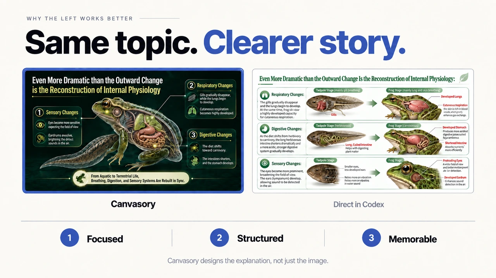
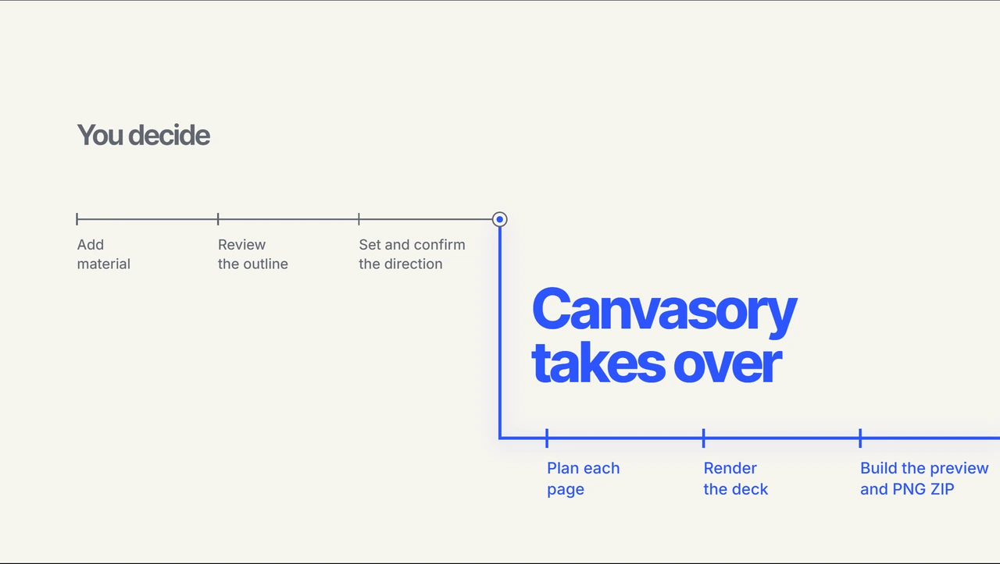
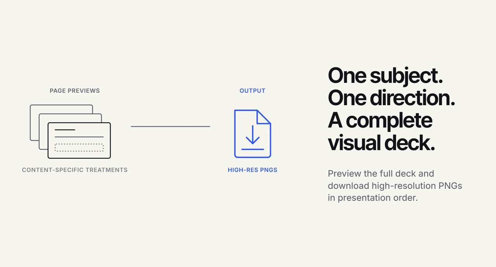

# Canvasory

**Turn source material into art-directed visual presentations.**

Canvasory is a Codex Skill that plans each page’s focus, imagery, relationships, layout, and reading order before image generation. Bring your material, review the page outline, and choose a creative direction; Canvasory turns that plan into a visual deck you can preview and download.

## Install

Send this sentence to Codex:

> Install this Skill: https://image-pptgen.pages.dev/install.sh

## Why Canvasory?

A subject tells you what a presentation is about. An art direction tells each page how to explain it.

Canvasory adds an **art-direction and page-blueprint planning layer** before image generation: what to show, how the parts relate, and where attention should go. You guide the overall direction; Canvasory handles the visual decisions for each page.

Canvasory packages a workflow, not a new image model. This supplied comparison illustrates one example, not a controlled benchmark or a guarantee of results. [Image provenance](docs/readme/PROVENANCE.md).

## How it works

1. **Add your material.** Start with text or Markdown.
2. **Review the outline.** Revise the pages and confirm the plan.
3. **Set the direction.** Choose Auto or describe a whole-deck direction, then confirm it.
4. **Preview and download.** Canvasory plans each page, renders the deck, and prepares your files.

Usage details

**Installation.** Use only the installation sentence and address above. Do not add a target directory, Python path, environment variable, or extra setup step. The installer and Skill manage their own location and configuration.

**Pagination.** Canvasory proposes a page split before spending image-generation capacity. The complete plan appears directly in the final reply, including after revisions, so it remains readable without expanding the work details. Review the page count, titles, and content, and request revisions as needed. You can change the page count without resubmitting the source. Explicitly confirm the final pagination; this confirmation does not start generation.

**Creative direction.** After confirming pagination, choose Auto or describe one creative direction for the entire deck. Auto delegates the visual direction; a written direction can be refined through conversation. In either case, the art director plans the message, imagery, text, layout, and reading flow for each slide. Separate style requests for individual slides are not supported.

**Confirmation.** Choosing Auto is not confirmation. Both Auto and a written direction require a separate, explicit confirmation of the final whole-deck direction. Only a final, unqualified confirmation starts generation; a request for changes keeps the direction pending.

**Language and review.** Presentation language follows your material and request. Review wording, factual accuracy, and visual details before presenting.

## What you get

- **Static Preview** — navigate between pages, zoom in, and view fullscreen without keeping a local service running.
- **High-resolution PNGs** — rendered slide images in presentation order.
- **Ordered ZIP** — the complete deck’s slide images packaged for download.

## Current limits

- **Input:** text and Markdown only. PDF, image, screenshot, and OCR input are not supported.
- **Editing:** slides are images, not editable PowerPoint objects. Changing content or composition may require image editing or regeneration.
- **Direction:** creative requirements apply to the whole deck, rather than separate styles for individual slides.
- **Platforms:** macOS ARM64 and Linux x86_64. Windows is not currently supported.
- **Access and usage:** model access and applicable usage limits still apply. Generation is not unlimited free or fully offline.

## FAQ

**Can I change the page count without resubmitting my source?**

Yes. Revise the proposed split, then confirm the final pagination.

**Does choosing Auto begin generation?**

No. Auto still requires a separate, explicit confirmation of the final direction.

**Can I give every slide a different visual style?**

No. Describe one creative direction for the whole deck.

**Can I edit every element after generation?**

The outputs are rendered images rather than native slide objects. Use image editing or regeneration when revisions are needed.

**Does the Preview need a background service?**

No. The completed Preview is static and does not need a local service to stay running.

## License & commercial use

Canvasory is source-available for **noncommercial use** under the [Canvasory Noncommercial License](LICENSE). **All commercial use requires a separate written commercial license**, including internal business use, client work, commercial presentations, and hosted services.

[Request commercial authorization](https://github.com/Sander-Chen/Canvasory/issues/new?title=Commercial%20license%20inquiry). An inquiry is not authorization. Third-party licenses and rights already granted for earlier Apache-2.0 material remain unchanged; see [LICENSE](LICENSE) for scope and terms.

## For developers

The Codex Skill is the user entry point. The source is available at [Sander-Chen/Canvasory](https://github.com/Sander-Chen/Canvasory).

| Path | Responsibility |
| --- | --- |
| `skills/canvasory/` | Codex Skill and guided presentation workflow |
| `packages/pptgen_toolkit/` | CLI client and static Preview packaging |
| `backend/` | Pagination, generation, state, audit, and artifacts |
| `frontend/` | Preview and local review interface source |
| `packaging/image/` | macOS ARM64 and Linux x86_64 adapters |

Earlier versions also included `eval-materials/` for English acceptance samples. That directory is no longer in the current tree; those samples were never a restriction on supported topics.
